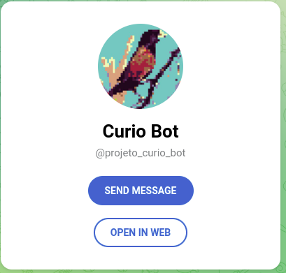

# [Problemas na Cidade](https://projeto-curio.vercel.app/) :construction: 

Esse é um projeto pessoal que visa criar uma solução para registro de problemas de infraestrutura nas cidades. 
O projeto vai englobar todas as partes API, Bot Telegram, App Mobile e Web.
Com o App Mobile é será possivel cadastrar a solução por usuario cadastrados e adicionar fotos, localização e descrição. 
O Bot Telegram é possivel registrar os problemas encontrados.
Na aplicação Web funcionara como um *back office* onde o responsavel tomara as medidas e respondera ao problema.

## [API](https://projeto-curio.cyclic.app/api/v1)

Esse foi implementamentado com o framework Express, KnexJS e o banco de dados PostgreSQL. A API esta hospedada está no [Cyclic.sh](cyclic.sh).
## [Bot](https://t.me/projeto_curio_bot)

O Bot Telegram @projeto_curio_bot foi feito com a lib Telegraf.

## [Web](https://projeto-curio.vercel.app/)

O *front e backoffice*  sua construção esta sendo feita com React e Ionic UI, a hospedagem esta na [Vercel](https://vercel.com).

## App Mobile - DESCONTINUADO

O Aplicativo está sendo construido com Ionic 5 com Capacitor. O sistema de mapas é o [Google Maps]. Esse é esta em fase final de construção.

### Backend

# Instalar pacotes
``npm install``

# Executar localmente

``npm run dev``

## Executar Migrations

``npm run knex:<ENV>``